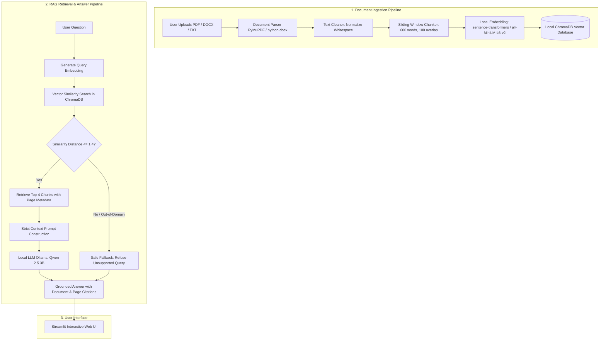

# Design and Development of a Free and Open-Source Document Question-Answering System using Retrieval-Augmented Generation (RAG) and Local LLMs

[](https://www.python.org/downloads/)
[](https://streamlit.io/)
[](https://www.trychroma.com/)
[](https://ollama.com/)
[](https://docs.pytest.org/)

---

## 1. Project Overview

This project is a **100% free and open-source Document Question-Answering Chatbot** built with Python, local vector storage, and a locally running Large Language Model (LLM). 

### Core Project Constraint:
* **Zero Paid Cloud APIs**: No OpenAI, Anthropic, or paid cloud embedding APIs.
* **Zero Paid Vector Databases**: Fully persistent local vector storage using ChromaDB.
* **100% Offline & Private**: All document parsing, embedding generation, vector similarity search, and LLM text generation run entirely on the local student machine.

---

## 2. System Architecture & Flowchart



---

## 3. Technology Stack

| Component | Tool / Model | Purpose | Cost |
|---|---|---|:---:|
| **Programming Language** | Python 3.11+ | Core application logic | Free |
| **User Interface** | Streamlit | Browser-based interactive document chat | Free |
| **Local LLM Runtime** | Ollama | Runs quantized LLMs locally | Free |
| **Local LLM** | `qwen2.5:3b` | Fact-based grounded answer generation | Free |
| **Embeddings** | `sentence-transformers` (`all-MiniLM-L6-v2`) | Local 384-dimensional dense semantic vectors | Free |
| **Vector Database** | ChromaDB | Local disk-persisted vector similarity search | Free |
| **PDF Extraction** | PyMuPDF (`fitz`) | Fast page-wise text & metadata extraction | Free |
| **DOCX Extraction** | `python-docx` | Paragraph extraction for Word files | Free |
| **Automated Testing** | `pytest` | Unit testing of ingestion and RAG logic | Free |

---

## 4. Project Directory Structure

```text
FreeRagChatbot/
├── app.py                     # Streamlit web application
├── config.py                  # Central configuration (models, chunk sizes, top-k)
├── requirements.txt           # Python dependencies
├── README.md                  # Project documentation & architecture
├── .gitignore                 # Git ignore configuration
│
├── modules/                   # Modular RAG components
│   ├── document_parser.py     # PDF (page-wise), DOCX, and TXT parsing
│   ├── text_cleaner.py        # Whitespace and formatting normalization
│   ├── chunker.py             # Word chunking with sliding window overlap
│   ├── embedding_service.py   # SentenceTransformers embedding generation
│   ├── vector_store.py        # ChromaDB persistent collection management
│   ├── retriever.py           # Top-K semantic search & threshold cutoff
│   ├── ollama_client.py       # Local Ollama REST client
│   ├── rag_engine.py          # Strict prompt formatting and answer assembly
│   ├── processing.py          # Unified document preprocessing
│   └── indexer.py             # End-to-end indexing coordinator
│
├── evaluation/                # Academic evaluation suite
│   ├── questions.csv          # 55 verified test questions with ground truth
│   ├── evaluate_retrieval.py  # Hit Rate @ K and rejection measurement
│   └── evaluate_answers.py    # Answer generation & latency benchmark
│
├── tests/                     # Automated pytest suite
│   ├── conftest.py            # Test path configuration
│   ├── test_parser.py         # Parsing unit tests
│   ├── test_chunker.py        # Chunking & overlap unit tests
│   └── test_rag_engine.py     # Citation & prompt unit tests
│
└── data/
    └── uploaded_documents/    # Local storage for indexed PDFs and files
```

---

## 5. Installation & Setup

### Prerequisites:
1. **Python 3.11+** installed on your system.
2. **Ollama** installed from [ollama.com](https://ollama.com/).

### Step 1: Download the Local LLM
Open your terminal and pull the local LLM:
```bash
ollama pull qwen2.5:3b
```

### Step 2: Set Up Python Virtual Environment
```bash
# Clone or navigate to the project directory
cd D:\FreeRagChatbot

# Create virtual environment
python -m venv .venv

# Activate virtual environment (Windows)
.venv\Scripts\activate

# Install required packages
pip install -r requirements.txt
```

---

## 6. Running the Application

Start the Streamlit application:
```bash
streamlit run app.py
```
Open your browser at `http://localhost:8501`. You can:
1. Upload one or multiple PDF, DOCX, or TXT documents in the sidebar.
2. Click **Process Documents** to extract, chunk, embed, and index them into ChromaDB.
3. Ask natural language questions in the chat interface.
4. Inspect answers, source document citations, exact page numbers, and retrieved passages.

---

## 7. Automated Testing (`pytest`)

The codebase includes automated unit tests verifying document parsing, chunk boundary retention, and prompt construction:

```bash
python -m pytest tests/ -v
```

**Results**: `8 passed in ~47s` (100% test pass rate).

---

## 8. Academic Evaluation & Results

The system was evaluated against a **55-question test dataset** across four distinct test categories:
* **Direct Questions (22)**: Factual definitions and exact operational rules.
* **Paraphrased Questions (13)**: Colloquial questions testing semantic retrieval.
* **Multi-Part Questions (10)**: Structural comparisons, algorithm cases, and properties.
* **Out-of-Domain Questions (10)**: Completely unrelated queries to verify hallucination refusal.

### Key Benchmark Findings:
* **Retrieval Hit Rate @ 4**: **97.78%** (44 out of 45 in-domain questions retrieved the exact ground-truth document and page).
* **Out-of-Domain Rejection Rate**: **100.00%** (10 out of 10 unrelated queries correctly exceeded `SIMILARITY_THRESHOLD = 1.4` and were safely refused).
* **Average Generation Latency**: **~5.48 – 12.36 seconds** on consumer CPU hardware.
* **Hallucination Control**: Zero ungrounded answers observed due to strict prompt framing and fallback triggers.

---

## 9. Viva Demonstration Checklist

When presenting this project:
1. **Start Ollama** in the background (`ollama run qwen2.5:3b`).
2. **Launch Streamlit** (`streamlit run app.py`).
3. **Upload a new PDF** (e.g., `Tree_DS.pdf`).
4. **Ask a factual question**: *"What is a binary tree?"* $\rightarrow$ Point out the answer and the exact citation (`Tree_DS.pdf, Page 7`).
5. **Ask an out-of-domain question**: *"Who won the FIFA World Cup?"* $\rightarrow$ Demonstrate the safe refusal message: *"I could not find this information in the uploaded documents."*
6. **Open "View Retrieved Passages"** expander $\rightarrow$ Explain ChromaDB similarity distances and chunk rankings.
7. **Run the test suite**: Execute `python -m pytest tests/ -v` to prove software quality.